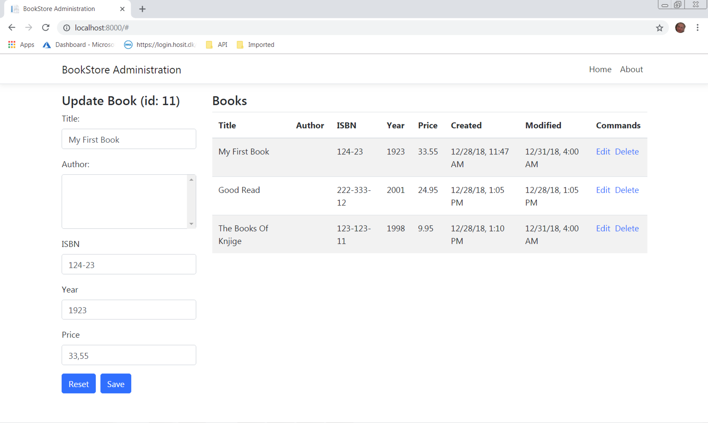

# CallidusSampleApp
> This is a sample managing books app for a fictius book store.

## Table of contents
* [General info](#general-info)
* [Screenshots](#screenshots)
* [Technologies](#technologies)
* [Setup](#setup)
* [Features](#features)
* [Status](#status)
* [Contact](#contact)

## General info
This app is made to demonstrate usage of ASP.NET and EF Core frameworks for building a sample app for managing books.

## Screenshots

## Technologies

  * [ASP.NET Core](https://get.asp.net/)
  * [EF Core](https://docs.microsoft.com/en-us/ef/core/)
  * [IdentityServer](https://identityserver.io/)
  * [LocalDB](https://docs.microsoft.com/en-us/sql/database-engine/configure-windows/sql-server-2016-express-localdb?view=sql-server-2017)
  * [Angular](https://angular.io/) and Typescript [http://www.typescriptlang.org/]
  * [Bootstrap](http://getbootstrap.com/) for layout and styling

## Setup
Clone repository locally to `C:\CallidusSampleApp` folder, and open up solution file. 
Check that solution is configured to run multiple (all) projects, and if so click on start.

NOTE: For application to run on a local machine ensure that you have LocalDB running. Check connection string [here](../blob/master/BookStore.Api/appsettings.json), and adjust if neccessary.

Three separate apps should start:
 * [BookStore API](../blob/master/BookStore.Api), which is used for for supporting CRUD operations, interacting with clients and managing data.
 * [BookStore Identity Server](../blob/master/BookStore.Identity), with configured InMemory store for authentication.
 * [BookStore Administration](../blob/master/BookStore.Frontend), user interface for book administration

## Features
Following features are supported
* Create, edit and delete a book
* Show all books in a grid
* Use IdentityServer for authentication
* Caching support by using [In Memory cache](https://docs.microsoft.com/en-us/aspnet/core/performance/caching/memory?view=aspnetcore-2.2)
* [Logging](https://docs.microsoft.com/en-us/aspnet/core/fundamentals/logging/?view=aspnetcore-2.2) 

To-do list:
* Change caching mechanisam so it uses Redis cache
* Add support for Application Insights
* Deploy to Azure Web App Services

## Status
Project is: _in progress_

## Contact
Created by [@vuvid]
